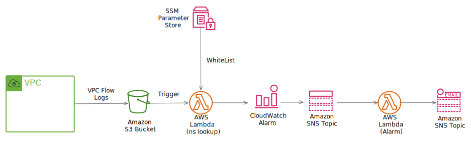

# NotifyUnexpectedAddress

Notify access to an unexpected external address from within the VPC.


VPCFlowlogs is a log based on ip addresses, making it difficult to determine access to abnormal ip addresses.　　
For this reason, this tool implements a warning function when it detects access to an ip address that is not in the whitelist.  

__How to use:__  
To add a good domain by accessing the white list, add it to the WhiteList of vpcflowlog.yml.  

  

## Deploying
### Requirements

- AWS Account
- Python 3.7 or greater
- AWS CLI latest

### Instructions

These are the deployment steps until the full implementation is complete.:

Locally, run following commands. 

1. Set variables

UPLOADBUCKETNAME:  
Create S3Bucket to upload Lambda Function in advance.  
Set BucketName to the following UPLOADBUCKETNAME.  

VPCID:
Id of VPC that outputs VPCFlowlogs.

MAILADDRESS:  
Destination address for notifying Service Status.

```bash
$ PROJECTNAME=opstools
$ ROLENAME=vpcflowlog
$ UPLOADBUCKETNAME=xxxxxxxxxxxx
$ VPCID=vpc-xxxxxxxxxxxxxxxxx
$ MAILADDRESS=xxxxx@xxx.xxx
```

2. Upload local artifacts  
```bash
$ aws cloudformation package \
    --template-file vpcflowlog_lambda.yml \
    --s3-bucket $UPLOADBUCKETNAME \
    --output-template-file packaged.yml
```

3. Deploys the specified AWS CloudFormation template
```bash
$ aws cloudformation deploy \
    --stack-name $PROJECTNAME-$ROLENAME \
    --region ap-northeast-1 \
    --template-file packaged.yml \
    --capabilities CAPABILITY_NAMED_IAM \
    --output text \
    --parameter-overrides \
        VpcId=$VPCID \
        NortificationMail=$MAILADDRESS
```
